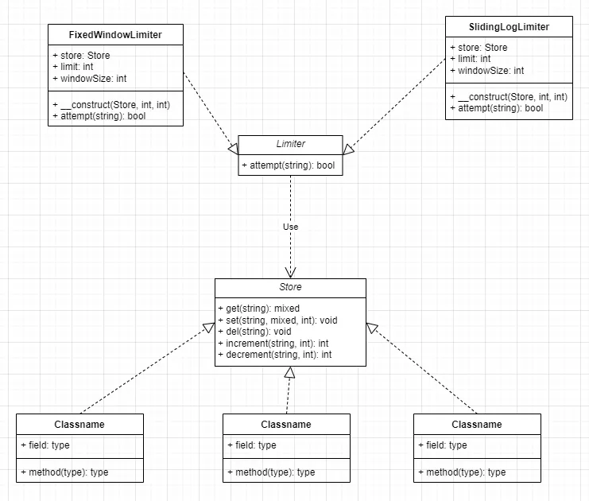

# Limiter

Limiter 是一个支持多种限流算法与存储后端的 API 限流器。

Limiter 要求 PHP >= 8.2。

# 目录

- [安装](#安装)
- [代码结构](#代码结构)
- [基本用法](#基本用法)
    - [固定窗口算法](#固定窗口算法)
    - [滑动日志算法](#滑动日志算法)


## 安装

```sh
composer require abtswath/limiter
```

## 代码结构



## 基本用法

Limiter 支持 `PSR-4` 自动加载。

```php
<?php
require_once 'vendor/autoload.php';
```

### 固定窗口算法

```php
<?php

$store = new Limiter\Store\MemoryStore();
$limiter = new Limiter\FixedWindowLimiter(store: $store, limit: 10, windowSize: 60);

$limiter->attempt($key);
```

### 滑动日志算法

```php
<?php

$store = new Limiter\Store\MemoryStore();
$limiter = new Limiter\SlidingLogLimiter(store: $store, limit: 10, windowSize: 60);

$limiter->attempt($key);
```
